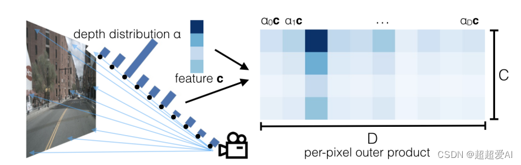
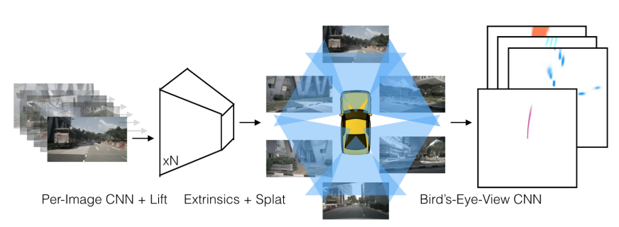

# 《Lift, Splat, Shoot: Encoding Images from Arbitrary Camera Rigs by Implicitly Unprojecting to 3D》
目前的计算机视觉算法任务，基于输出结果是否与输入图像在同一个参考系下，可以分为两类：

* 预测结果与输入不在同一个参考系：分类

* 预测结果与输入在同一个参考系：目标检测、语义分割、全景分割

从这个角度来看，基于BEV的自动驾驶感知算法，属于前一个类别，即预测结果与输入不在同一个参考系，最终得到的BEV结果属于本体车辆参考系，而图像属于相机参考系，一般的做法是，通过算法模型，把属于多个参考系下的多模态数据，进行融合预测，形成在BEV参考系下的预测结果。

针对多参考系转换问题，又引出了很多研究方法。例如，可以扩展传统单视图的范式，把它扩展到多视图模式上。具体来说，针对来自n个相机的图像数据，我们使用一个单视图检测器，针对每个相机的每张图像数据进行检测，然后将检测结果根据对应相机的内外参数，转换到车辆本体参考下，这样就完成了多视图的检测。

但是这样的简单后处理方法是有问题，比如，我们可能想要通过训练结果反馈，进行反向传播，并进一步调整对应相机的输入，这一步是无法完成，因为上面的转换是单向的，也就是说，我们无法反向区分不同特征的坐标系来源，因此我们无法轻易的使用一个端到端的模式来训练改善我们的自动感知系统。

本文的做法是通过将二维图像特征生成3D特征（这一步对应论文中的"Lift"操作），然后把3D特征“拍扁”得到BEV特征图（这一步对应论文中的"Splat"），最终在BEV特征图上进行相关任务操作（这一步对应于"Shoot"）。
## Lift
Lift是指将多视角的相机图像从扁平的透视空间，“提升”到3维空间当中。

单目相机融合的难点在于像素的深度未知，LSS的做法是为每一个像素通过网络预测一个深度。具体做法是给每个像素在一系列可能的离散深度值上预测一个概率向量$\alpha = [\alpha_0 ,\alpha_1,\alpha_2,...,\alpha_{D-1}]^T$。假设通过backbone在每个像素上提取到的特征维度为C，那么每个像素点的特征向量为$c=[c_0,c_1,c_2,...,c_{c-1}]^T$,则最终该像素在深度值d的特征$c_d=\alpha_dc$,即相当于让概率向量与特征向量做外积$c\alpha^T$，实现增维的操作。

经过这一步操作就相当于在每个像素的每个离散深度值上都创造了一个点，之后再将这每个点通过相机内参和外参投影到自车坐标系下，则就完成了Lift操作。

## Splat
在Lift操作中，得到了一系列点及其特征。在车辆周围划分网格，将Lift操作中得到的每个点分配到每个网格当中，然后进行sum pooling操作（对每个网格中的点特征求和），再通过resnet网络降维，拍扁，最终得到多个视角图像融合的BEV特征。
## shoot
对splat得到的特征进行编解码处理，实际上可以看作bev特征提取器，将编解码后的特征用于目标任务。

# References
[Lift-Splat-Shoot：论文、代码解析](https://blog.csdn.net/weixin_45112559/article/details/127186229)

[LSS-lift splat shoot论文与代码解读](https://blog.csdn.net/weixin_41803339/article/details/127140039?spm=1001.2101.3001.6661.1&utm_medium=distribute.pc_relevant_t0.none-task-blog-2%7Edefault%7ECTRLIST%7ERate-1-127140039-blog-127186229.pc_relevant_aa&depth_1-utm_source=distribute.pc_relevant_t0.none-task-blog-2%7Edefault%7ECTRLIST%7ERate-1-127140039-blog-127186229.pc_relevant_aa&utm_relevant_index=1)

[Lift, Splat, Shoot: Encoding Images from Arbitrary Camera Rigs by Implicitly Unprojecting to 3D](https://blog.csdn.net/qq_30483585/article/details/125234126?spm=1001.2101.3001.6661.1&utm_medium=distribute.pc_relevant_t0.none-task-blog-2%7Edefault%7EBlogCommendFromBaidu%7ERate-1-125234126-blog-126779393.pc_relevant_3mothn_strategy_recovery&depth_1-utm_source=distribute.pc_relevant_t0.none-task-blog-2%7Edefault%7EBlogCommendFromBaidu%7ERate-1-125234126-blog-126779393.pc_relevant_3mothn_strategy_recovery&utm_relevant_index=1)

[[paper] lift,splat,shooting 论文浅析](https://blog.csdn.net/weixin_51449137/article/details/126662391?spm=1001.2101.3001.6650.2&utm_medium=distribute.pc_relevant.none-task-blog-2%7Edefault%7ECTRLIST%7ERate-2-126662391-blog-126779393.pc_relevant_layerdownloadsortv1&depth_1-utm_source=distribute.pc_relevant.none-task-blog-2%7Edefault%7ECTRLIST%7ERate-2-126662391-blog-126779393.pc_relevant_layerdownloadsortv1&utm_relevant_index=3)

[Lift, Splat, Shoot 翻译](https://blog.csdn.net/weixin_43889128/article/details/121787398?spm=1001.2101.3001.6650.6&utm_medium=distribute.pc_relevant.none-task-blog-2%7Edefault%7EBlogCommendFromBaidu%7ERate-6-121787398-blog-123840434.pc_relevant_multi_platform_whitelistv4&depth_1-utm_source=distribute.pc_relevant.none-task-blog-2%7Edefault%7EBlogCommendFromBaidu%7ERate-6-121787398-blog-123840434.pc_relevant_multi_platform_whitelistv4&utm_relevant_index=6)

