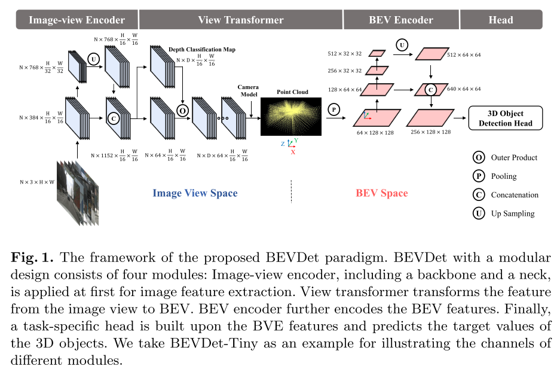
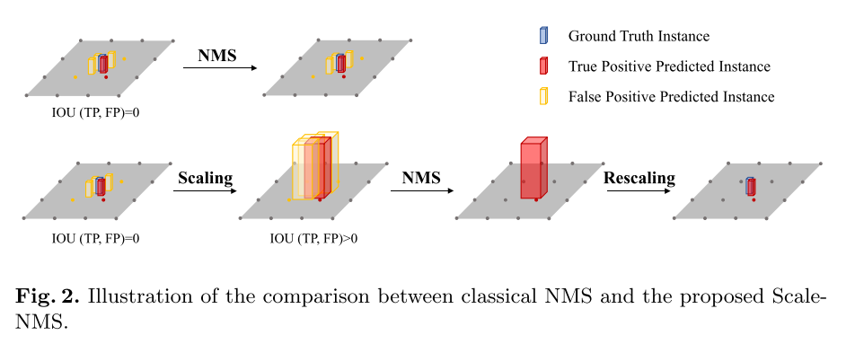

<head>
    
    
</head>

# 《BEVDet: High-Performance Multi-Camera 3D Object Detection in Bird-Eye-View》
## 主要工作
沿用了LSS的框架，通过构建一个专属的数据增强策略和升级非最大抑制策略，实质性地提高了它的性能。

## 动机
在多摄像机三维目标检测中，基于图像视图的FCOS3D、PGD等方法性能领先，而基于BEV的PON、lift-splat-shoot、VPN等方法在BEV语义分割中占据主导地位。

于是文章提出了一种在 BEV 视角下检测3d物体的方法，主要是在LSS（Lift-Splat-Shoot）基础上增加CenterPoint的head进行3d检测，另外增加了BEV空间的数据增广，在Nuscenes 上取得了SOTA效果

如图是基于现有模型构建的BEVDet模型：

## 论文思路
BEVDet包含4个部分，即图像编码器（提取图像特征）、视图转换器（将图像视图转化为BEV）、BEV编码器（进一步提取BEV特征）和检测头（BEV下检测3D物体或进行语义分割），如上图所示。
## 问题
虽然构建BEVDet的框架很简单，但构建其鲁棒性是非常重要的。在验证BEVDet的可行性时，为了合理的性能，将BEVDet数据处理策略和参数编号设置为接近基于图像视图的3D对象检测器,在训练过程中发现了严重的过拟合问题。一些线索表明，问题出在BEV空间中BEVDet的过度装配能力。

训练数据不足也是BEV空间学习过度拟合的部分原因。此外，我们观察到视图变换器以像素方式连接图像视图空间和BEV空间。这使得图像视图中的数据增强对子序列模块（即BEV编码器和3D对象检测头）没有正则化效果。

**方法-专属的数据增强策略**

因此，作为补充，在BEV空间中执行额外的数据增强操作，如翻转、缩放和旋转，以确保模型在这些方面的鲁棒性。这可以很好地防止BEVDet过度装配。

**方法-升级非最大抑制策略**

为了提高在3D对象检测场景中的适应性，升级了经典的非最大抑制（NMS）策略。通过移除顺序执行的运算符，进一步加快了推理过程。通过这些修改，BEVDet在现有范例中提供了准确度和推理延迟之间的出色权衡。

## 方法论
### 网络结构
如上图，主要有四个模块构成：
**Image-view Encoder**
作用：将输入图像编码为高级特征
结构：为了实现多分辨率特征，包括一个用于高级别特征提取的主干和一个用于多分辨率特征融合的颈部
主干选择：ResNet，SwinTransformer，DenseNet，HRNet等
颈部选择：FPN-LSS
**View transformer**
作用：将图像特征映射到鸟瞰图坐标
方法：利用了LSS中的深度估计算法，先对图像进行升维构造视锥，然后利用类似point pillars的方法，voxel pooling进行降维得到鸟瞰图。
**BEV Encoder**
作用：进一步对BEV空间的特征进行编码
结构：类似于image-view Encoder，但它可以高精度地感知一些关键线索，如比例、方向和速度
**Task-specific Head**
作用：根据所执行任务设计输出头
3D物体检测旨在检测行人、车辆、障碍物等可移动物体的位置、比例、方向和速度
### 定制数据增强策略
**The Iso View Spaces**
相机坐标系和图像坐标系的转换（利用估计的深度d和相机内参矩阵I）
$$ p_{camera}=I^{-1}(p_{image}*d) $$常规的数据增强包括翻转，裁剪，旋转，可用一个3*3矩阵A来表示，$p^{'}_{image}=Ap_{image}$

为了保证特征和目标在BEV空间的一致性，在进行view transformer时应该用A的逆矩阵解除数据增强带来的变化，这就相当于数据增强在BEV空间没有起到作用。

**BEV Space Learning with Data Augmentation**

因为BEV空间数据的有限性，训练容易陷入过拟合，由于视图变换器在增强透视图中隔离了两个视图空间，因此我们构建了另一种增强策略，专门针对BEV空间中学习的正则化效果。

这种数据增强策略建立在视图转换器可以将imageview编码器与后续模块解耦的前提下。这是BEVDet的一个特殊特征，在其他方法中可能无效。 
### Scale-NMS
**问题：** BEV空间中不同类别的空间分布与图像视图空间中的空间分布截然不同。在图像视图空间中，由于相机的透视成像机制，所有类别共享相似的空间分布。常见的物体检测范式冗余地生成预测。每个对象占用的小面积可能会使冗余结果与真正的正结果没有交集。这使依赖IOU来访问真阳性和假阳性之间的空间关系的经典NMS失效。
**解决方法：Scale-NMS**在执行经典NMS算法之前，根据每个对象的类别缩放其大小。通过这种方式，调整真阳性和冗余结果之间的IOU分布，以与经典NMS匹配。缩放因子是特定于类别的。它们是通过对验证集进行超参数搜索生成的

## References
[论文精读《BEVDet: High-Performance Multi-Camera 3D Object Detection in Bird-Eye-View》](https://blog.csdn.net/zyw2002/article/details/127907620?spm=1001.2101.3001.6650.3&utm_medium=distribute.pc_relevant.none-task-blog-2%7Edefault%7EOPENSEARCH%7ERate-3-127907620-blog-127677478.pc_relevant_3mothn_strategy_and_data_recovery&depth_1-utm_source=distribute.pc_relevant.none-task-blog-2%7Edefault%7EOPENSEARCH%7ERate-3-127907620-blog-127677478.pc_relevant_3mothn_strategy_and_data_recovery&utm_relevant_index=4)

[BEVDet:High-Performance Multi-Camera3D Object Detection in Bird-Eye-View](https://blog.csdn.net/qq_46460131/article/details/127677478)